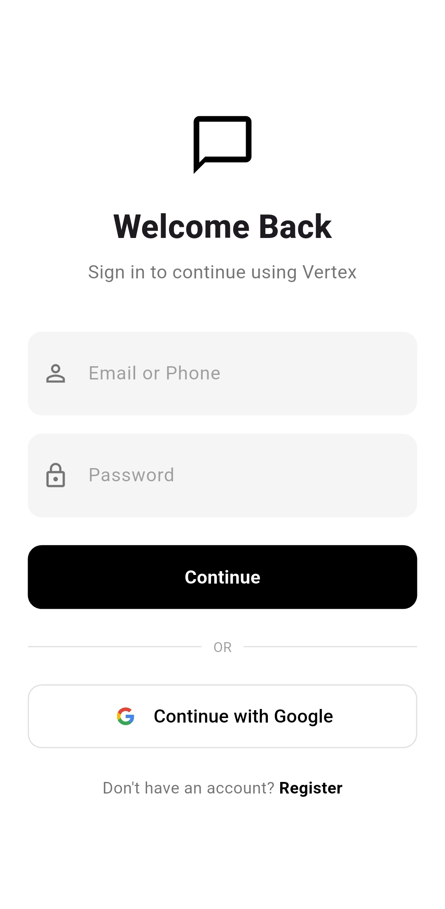
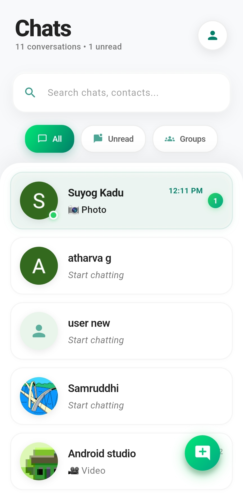
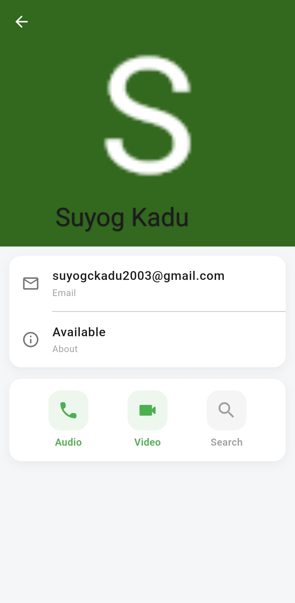
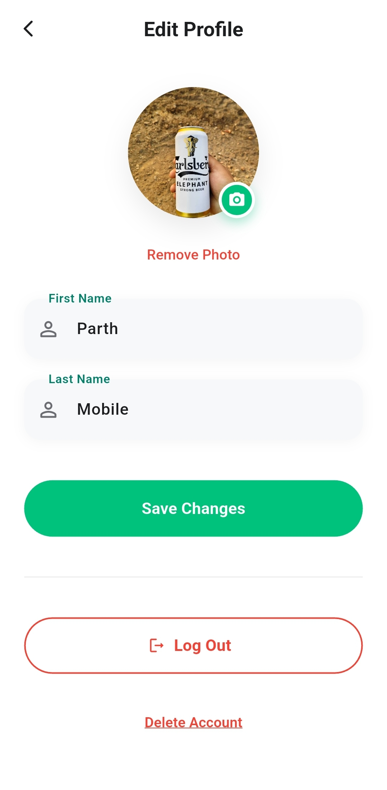
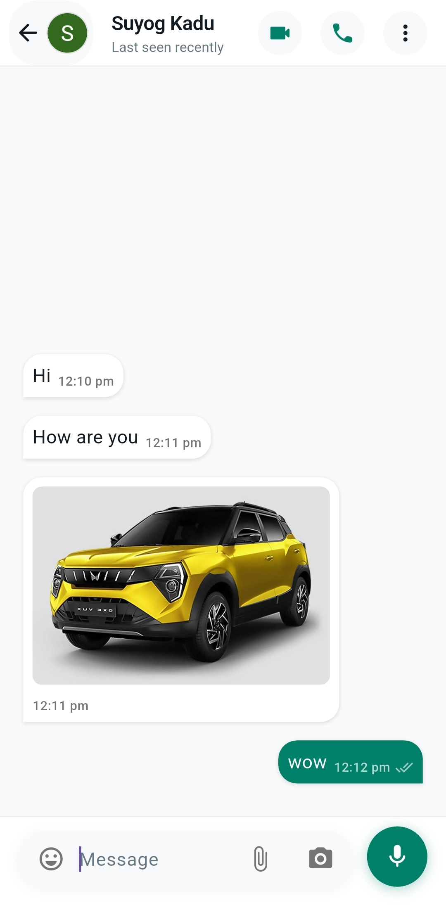
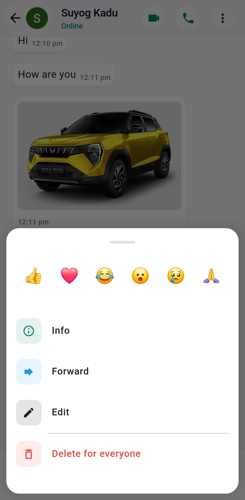
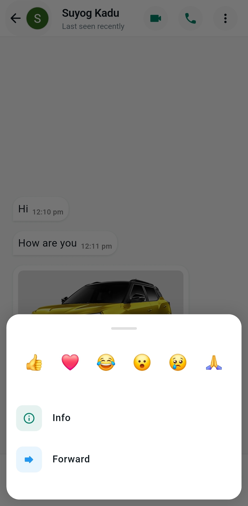
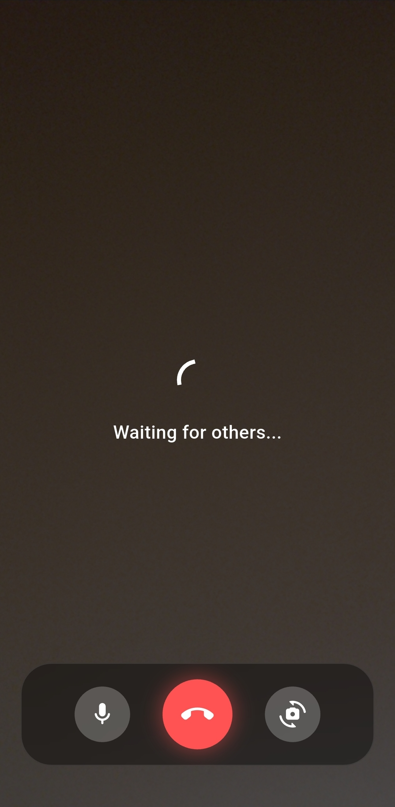
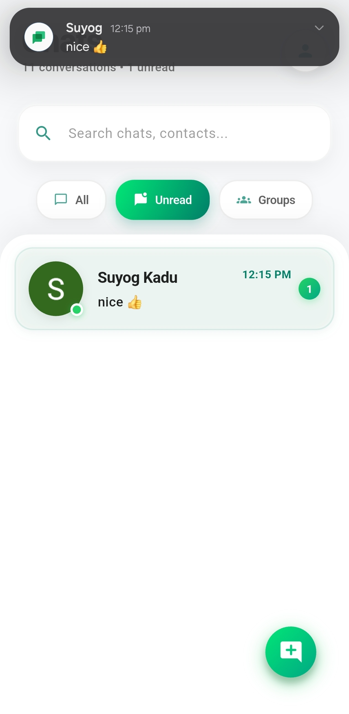

# 🚀 Vertex - The Future of Chat

<div align="center">
  
  
  
  
</div>

<br/>

**Vertex** is a premium, fast, and highly secure real-time messaging application built with **Flutter**. It provides a seamless communication experience with features like instant messaging, group chats, high-definition audio/video calls, and rich media sharing.

## ✨ Key Features

### 🔐 Secure & Flexible Authentication
* **Multiple Logins:** Supports Email/Password, Phone Number (OTP), and Google Sign-In.
* **Presence System:** Real-time Online/Offline status and "Last seen" tracking.

### 💬 Advanced Messaging Experience
* **1-to-1 & Group Chats:** Chat privately or create groups with multiple participants.
* **Message Controls:** Edit sent messages or use "Delete for Everyone" to revoke messages.
* **Reactions & Replies:** React to any message with emojis and swipe to reply to specific texts.
* **Read Receipts:** Real-time delivery and read status (Blue Ticks).

### 📞 HD Audio & Video Calling
* **Powered by Agora:** Crystal clear audio and high-definition video calls.
* **Group Calls:** Dynamic grid layout for multiple participants.
* **Floating Video:** Picture-in-Picture (PiP) style floating local video window.

### 📎 Rich Media & Notifications
* **Lightning Fast Media:** Images and videos are stored and retrieved quickly using **Supabase Storage**.
* **Immersive Viewing:** Full-screen zoomable image viewer and built-in video player.
* **Smart Push Notifications:** Handled via Firebase Cloud Messaging (FCM) to ensure you never miss a call or message, even when the app is in the background. Custom ringtones for incoming calls.

---

## 🛠️ Tech Stack

* **Frontend:** Flutter & Dart
* **Backend & Database:** Firebase (Cloud Firestore)
* **Authentication:** Firebase Auth
* **Media Storage:** Supabase Storage (Optimized for fast uploads/downloads)
* **Real-time Calling:** Agora RTC Engine
* **Push Notifications:** Firebase Cloud Messaging (FCM) & `flutter_local_notifications`

---

## 📸 Screenshots

<p align="center">
   &nbsp;&nbsp;
   &nbsp;&nbsp;
   &nbsp;&nbsp;
  
  <br/><br/>

   &nbsp;&nbsp;
   &nbsp;&nbsp;
   &nbsp;&nbsp;
  
  <br/><br/>
  
   &nbsp;&nbsp;
   &nbsp;&nbsp;
   &nbsp;&nbsp;
  
</p>

---

## 🚀 Getting Started

Follow these steps to set up the project on your local machine.

### Prerequisites
* [Flutter SDK](https://flutter.dev/docs/get-started/install) installed.
* A Firebase Project (Firestore, Auth, and Messaging enabled).
* A Supabase Project (for Storage).
* An Agora Account (for App ID).

### Installation Steps

1. **Clone the repository:**
   ```bash
   git clone [https://github.com/](https://github.com/)<your-username>/vertex-chat.git
   cd vertex-chat
